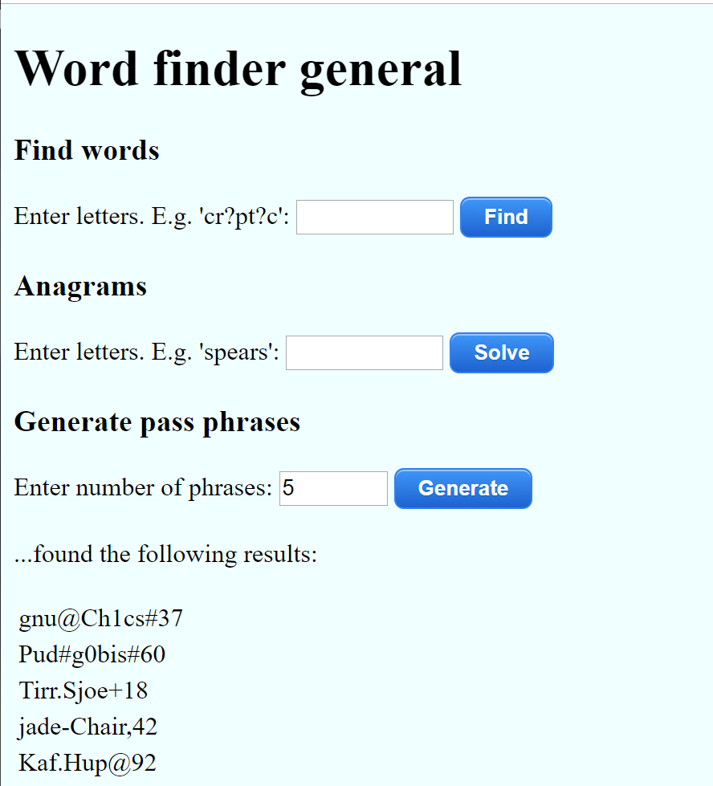

# Word Finder General Docker image

A basic containerized word finder toolkit. Deploy from the Azure Cloud Shell (shell.azure.com) which has the latest Azure CLI and VS Code pre-installed.

# Get the app
```bash
git clone https://github.com/gbowerman/wfgdocker
```
# Deploy the app
```bash
./deploydemo.sh nameofwebapp
```
Where _nameofapp_ is a unique name. 

After a few minutes the app will be available at https://nameofapp.azurewebsites.net

# Remove the app
This script removes the resource group created by the deploy script.

```bash
./resetdemo.sh nameofwebapp
```
# About the app..
The app is a Python Flask based web app that provides word finding features..

- __Find words__ - Useful for solving crosswords. Put question marks for the letters you don't know. Note: output is limited to 100 words.
- __Anagrams__ - Finds anagrams based on the letters you enter.
- __Generate pass phrases__ - Randomly generate a set of passwords based on a combination of words, punctuation and numbers, which suit most password requirements, are relatively easy to remember, with fairly high entropy.



This app uses a word list from: [https://github.com/atebits/Words/](https://github.com/atebits/Words/) - thanks @atebits for curating this list and making it available.


